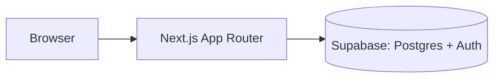

# Architecture

A living reference for how fithub-web is built: stack, structure, data models, and the reasoning behind key decisions.

## How to use this doc

- Update it when a decision is made, not just when code is written — the "why" matters more than the "what."
- Keep the **Data Models** section in sync with the actual DB schema; treat drift as a bug.
- Log significant changes in **Decision Log** rather than editing history away — future-you will want to know what was tried before.

---

## Overview

[1-2 sentences: what the app does, who it's for.]

---

## Tech Stack

| Layer | Choice | Why | Notes |
|---|---|---|---|
| Framework | Next.js (App Router) | | |
| Language | TypeScript | | |
| Styling | | | |
| Database | Supabase (Postgres) | | |
| Auth | Supabase Auth | | |
| Hosting / Deploy | | | |
| Package manager | | | |
| Testing | | | |

---

## System Architecture

[High-level description of how pieces fit together — client, server components, API routes, DB, third-party services. A diagram helps once there's enough to draw.]



---

## Folder Structure

```
src/
  app/          # routes (App Router)
  components/   # shared UI components
  lib/          # supabase clients, utilities
  ...
```

[Update as the real structure solidifies.]

---

## Data Models

One block per table/entity. Keep field names/types matched to the actual schema (migration files are the source of truth — this is the human-readable summary).

### `[table_name]`

| Column | Type | Constraints | Notes |
|---|---|---|---|
| id | uuid | PK, default gen_random_uuid() | |
| created_at | timestamptz | default now() | |
| | | | |

**Relations:** [e.g. belongs to `users.id` via `user_id`]

---

## Environments & Deployment

| Environment | URL | Supabase project | Notes |
|---|---|---|---|
| Local | localhost:3000 | | |
| Staging | | | |
| Production | | | |

**CI/CD:** [how deploys are triggered — e.g. Vercel on push to main, preview deploys per PR]

---

## Decision Log

Record notable architectural decisions here, newest first — especially ones with real tradeoffs or that reversed an earlier choice.

### [Decision title]
- **Date:** YYYY-MM-DD
- **Decision:** What was chosen.
- **Alternatives considered:** What else was on the table.
- **Rationale:** Why this won.

---

## Open Questions

- [Unresolved architectural question worth revisiting]

erDiagram
    USERS ||--o{ WORKOUTS : creates
    USERS ||--o{ WORKOUT_LOGS : logs
    USERS ||--o{ SCHEDULES : sets
    USERS ||--o{ EXERCISES : "creates (custom)"
    WORKOUTS ||--o{ WORKOUT_EXERCISES : contains
    EXERCISES ||--o{ WORKOUT_EXERCISES : "used in"
    EXERCISES ||--o{ SET_LOGS : "performed as"
    WORKOUTS ||--o{ WORKOUT_LOGS : "instance of"
    WORKOUT_LOGS ||--o{ SET_LOGS : records
    WORKOUTS ||--o{ SCHEDULES : "scheduled as"

    USERS {
        uuid id PK
        text email
        text password_hash
        text display_name
        timestamptz created_at
    }

    EXERCISES {
        uuid id PK
        text name
        text muscle_group
        text equipment
        uuid created_by FK "nullable, null = system exercise"
    }

    WORKOUTS {
        uuid id PK
        uuid user_id FK
        text name
        timestamptz created_at
        timestamptz deleted_at "nullable, soft delete"
    }

    WORKOUT_EXERCISES {
        uuid id PK
        uuid workout_id FK
        uuid exercise_id FK
        int order_index
        int target_sets
        int target_reps
    }

    WORKOUT_LOGS {
        uuid id PK
        uuid user_id FK
        uuid workout_id FK "nullable, null = ad-hoc log"
        timestamptz started_at
        timestamptz completed_at "nullable"
    }

    SET_LOGS {
        uuid id PK
        uuid workout_log_id FK
        uuid exercise_id FK
        int set_number
        int reps
        numeric weight_kg
        numeric rpe "nullable"
        timestamptz completed_at
    }

    SCHEDULES {
        uuid id PK
        uuid user_id FK
        uuid workout_id FK
        int day_of_week
    }
</content>
</invoke>

